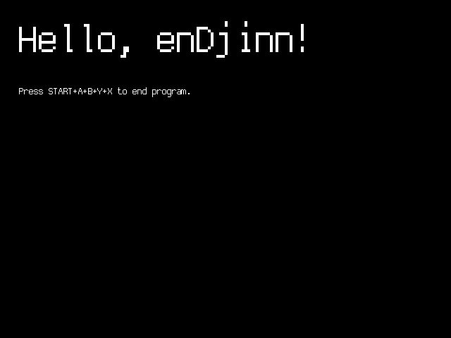

# enDjinn

## What is enDjinn?
It is very obviously a play on the word 'engine', which enDjinn isn't quite, and an invocation of the Middle Eastern mythos of supernatural invisible beings, Djinn, or Genies as they are more commenly known as in the west.
<div>

</div>

So in short an invisible helper that sets heaven and earth in motion for you without any fuss and guides you along your quest to deliver software for the Dreamcast.

enDjinn really tries to do all the boilerplate stuff for you in a reasonable way, leading to that the following 29 lines of C code: 

```c
#include <enDjinn/enj_enDjinn.h>
#define MARGIN_LEFT (20 * ENJ_XSCALE)

void render_PT(void *__unused) {
  enj_font_scale_set(4);
  enj_qfont_write("Hello, enDjinn!", MARGIN_LEFT, 20, PVR_LIST_PT_POLY);
  enj_font_scale_set(1);
  enj_qfont_write("Press START+A+B+X+Y to end program.", MARGIN_LEFT, 120,
                  PVR_LIST_PT_POLY);
}
void main_mode_updater(void *__unused) {
  enj_render_list_add(PVR_LIST_PT_POLY, render_PT, NULL);
}
int main(__unused int argc, __unused char **argv) {
  // initialize enDjinn state with default values
  enj_state_init_defaults();
  if (enj_state_startup() != 0) {
    ENJ_DEBUG_PRINT("enDjinn startup failed, exiting\n");
    return -1;
  }
  enj_mode_t main_mode = {
      .name = "Main Mode",
      .mode_updater = main_mode_updater,
      .data = NULL,
  };
  enj_mode_push(&main_mode);
  enj_state_run();
  return 0;
}
```
Gives you a functional program on the Dreamcast with this single screen: 



Notice that the **Makefile** for this program is just a symlink to the [enDjinn/Makefile.prime](Makefile.prime) that is amended with one line in the [Makefile.local.cfg](./examples//enj_hello/Makefile.local.cfg) for injecting enDjinns built in qfont. So one symlink and two files in total and a bit of adherence to how enDjinn expects things to be arranged and you're off to make things run on the Dreamcast!

The complete setup can be found in the examples folder in this repository: [enj_hello](./examples/enj_hello/)

And please don't worry about being strong armed into a rigoristic and very specific way to do things, because while one part of the design philosphy is "powerfull zero config features out of the gate", another part is "as much a as possible should be reconfigurable by the user". I'll have more on how to wrangle the make system to your tastes and needs later. 

Apart from the build system alluded to above, another big part of enDjinn is the runtime that tries to alleviate some of quirks of the Dreamcast system while amplifying its strengths. In this runtime you'll find a gameplay loop driver, a powerful state machine, texture loading, a truetype based fonting system, controller and rumblepack handling and various other small things that I like to reuse between projects. 

I'll add more documentation to all of the above and some features I haven't mentioned it in due time.

My current outline of topics to cover is as follows:

## Build System
### Automagic 
### Absolutely Configurable

### Generators
#### Textures
#### Fonts
The simplicity of the qfont system is demonstrated in the [enj_hello](./examples/enj_hello/) example. 

For richer font requirements to the [enj_writing example](./examples/enj_writing/code/enj_writing.c) for now. A more in depth description of this will follow. 

#### Sound Effects
#### CDI Images

## Runtime
### State Machine

### Texture Handling 

### Font System

### Hardware Abstraction

#### PVR rendering
#### Controllers
#### Rumble packs
#### File System 


## Helper Methods

## Profiling
### dctrace
### dcprof 
