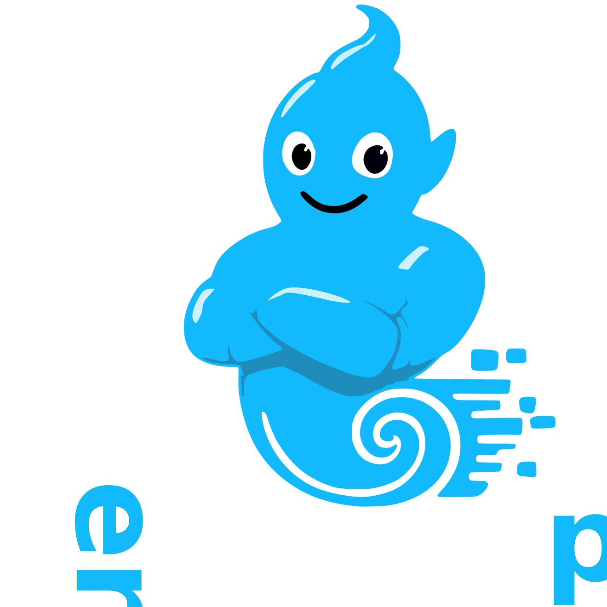
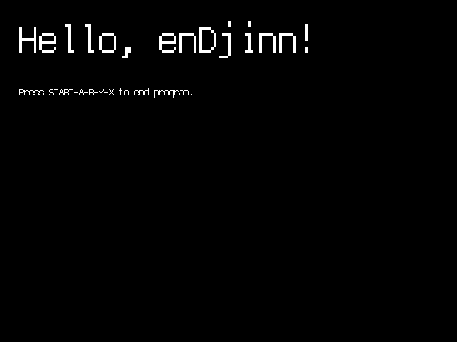

# enDjinn

## What is enDjinn?
It is very obviously a play on the word 'engine', which enDjinn isn't quite, and an invocation of the Middle Eastern mythos of supernatural invisible beings, Djinn, or Genies as they are more commenly known as in the west.
<div>

</div>

So in short an invisible helper that sets heaven and earth in motion for you without any fuss and guides you along your quest to deliver software for the Dreamcast.

enDjinn really tries to do all the boilerplate stuff for you in a reasonable way, leading to that the following 29 lines of C code: 

```c
#include <enDjinn/enj_enDjinn.h>
#define MARGIN_LEFT (20 * ENJ_XSCALE)

void render_PT(void *__unused) {
  enj_font_scale_set(4);
  enj_qfont_write("Hello, enDjinn!", MARGIN_LEFT, 20, PVR_LIST_PT_POLY);
  enj_font_scale_set(1);
  enj_qfont_write("Press A+B+X+Y+START to end program.", MARGIN_LEFT, 120,
                  PVR_LIST_PT_POLY);
}
void main_mode_updater(void *__unused) {
  enj_render_list_add(PVR_LIST_PT_POLY, render_PT, NULL);
}
int main(__unused int argc, __unused char **argv) {
  // initialize enDjinn state with default values
  enj_state_init_defaults();
  if (enj_state_startup() != 0) {
    ENJ_DEBUG_PRINT("enDjinn startup failed, exiting\n");
    return -1;
  }
  enj_mode_t main_mode = {
      .name = "Main Mode",
      .mode_updater = main_mode_updater,
      .data = NULL,
  };
  enj_mode_push(&main_mode);
  enj_state_run();
  return 0;
}
```
Gives you a functional program on the Dreamcast with this single screen: 



Notice that the **Makefile** for this program is just a symlink to the [enDjinn/base_link.mk](base_link.mk) that is amended with one line in the [local.cfg.mk](./examples//enj_hello/local.cfg.mk) for injecting enDjinns built in qfont. So one symlink and two files in total and a bit of adherence to how enDjinn expects things to be arranged and you're off to make things run on the Dreamcast!

The complete setup can be found in the examples folder in this repository: [enj_hello](./examples/enj_hello/)

And please don't worry about being strong armed into a rigoristic and very specific way to do things, because while one part of the design philosphy is "powerfull zero config features out of the gate", another part is "as much a as possible should be reconfigurable by the user". I'll have more on how to wrangle the make system to your tastes and needs later. 

Apart from the build system alluded to above, another big part of enDjinn is the runtime that tries to alleviate some of quirks of the Dreamcast system while amplifying its strengths. In this runtime you'll find a gameplay loop driver, a powerful state machine, texture loading, a truetype based fonting system, controller and rumblepack handling and various other small things that I like to reuse between projects. 

I'll add more documentation to all of the above and some features I haven't mentioned it in due time.

Until I get around to that task, I suggest going through [the many examples](./examples/README.md) included in this repository for reference and inspiration. 

My current outline of topics to cover is as follows:

## Build System
### Automagic 
### Absolutely Configurable

### Generators
#### Textures
#### Fonts
The simplicity of the qfont system is demonstrated in the [enj_hello](./examples/enj_hello/) example. 

For richer font requirements refer to the [enj_fonts example](./examples/enj_fonts/code/enj_fonts.c) for now. A more in depth description of this will follow. 

#### Sound Effects
#### CDI Images

## Runtime
The enDjinn runtime is designed to take the technical burden off the developer so they can focus on gameplay. It manages the core loop, input, and hardware-specific synchronization.

### State Machine & Mode Stack
At the heart of enDjinn is the **Mode Stack**. Instead of a single giant `switch` statement for your game states, you push and pop `enj_mode_t` structures.

- **Stack-based logic:** Push a "Pause Menu" mode on top of your "Game" mode using `enj_mode_push()`. When the player exits the menu, call `enj_mode_pop()` to return exactly where they were.
- **Updaters:** Each mode has a `mode_updater` function pointer called every frame by the engine.
- **Activation Hooks:** `on_activation_fn` lets you run logic specifically when a mode becomes the top of the stack (e.g., triggering a fade-in or loading assets).
- **Soft Resets:** Standardized handling via `enj_mode_soft_reset_target_set()`, allowing the classic A+B+X+Y+Start combo to return the user to a specific menu instead of just rebooting the console.

```c
enj_mode_t my_mode = {
    .name = "Level 1",
    .mode_updater = level_logic,
    .on_activation_fn = setup_level
};
enj_mode_push(&my_mode);
```

### Rendering Pipeline
enDjinn abstracts the Dreamcast's PowerVR chip using **Render Lists**. You don't call rendering functions directly in your logic; instead, you register them to be called during the appropriate PVR phase.

- **Phase Architecture:** register your functions to `PVR_LIST_OP_POLY` (Opaque), `PVR_LIST_PT_POLY` (Punch-Thru), or `PVR_LIST_TR_POLY` (Translucent).
- **Automatic Sync:** The engine manages `pvr_wait_ready()`, `pvr_scene_begin()`, and `pvr_scene_finish()`.
- **Post-Frame Callbacks:** Use `enj_render_post_callback_set()` for logic that must run immediately after the hardware has finished drawing (like input polling or physics updates).

### Font System
Text rendering is a first-class citizen in enDjinn, supporting both rapid debugging and polished UI:
- **`qfont` (Quick Font):** A built-in, 8x16 proportional font. Use `enj_qfont_write()` for zero-setup text display in any render list.
- **`.enjfont` (Proportional Textures):** High-quality fonts generated from TTF. These are stored as 4-bit paletted textures to save VRAM while allowing for smooth scaling.
- **Styling:** The engine supports real-time scaling via `enj_font_scale_set()`, custom letter spacing, and Z-index management. 
- **PVR Integration:** Use specialized headers like `enj_font_PAL_TR_header()` to render translucent text with custom front/back colors and palette offsets.

### Hardware Abstraction & Controllers
enDjinn simplifies Dreamcast hardware interaction:
- **Button State Machine:** Every button utilizes a 2-bit state (`ENJ_BUTTON_UP`, `ENJ_BUTTON_DOWN`, `ENJ_BUTTON_UP_THIS_FRAME`, `ENJ_BUTTON_DOWN_THIS_FRAME`). This allows you to check for a single-frame "press" or "release" without manually tracking previous button states.
- **Abstract Controllers:** `enj_abstract_ctrlr_t` provides a layer that makes Local Maple controllers, AI-controlled bots, or even network-linked inputs indistinguishable to your game logic.
- **Rumble Packs:** Trigger vibration easily on any port without diving into Maple bus specifics.
- **VMU Support:** Integrated hooks for LCD icon management and simple state serialization.

## Build System
The enDjinn build system is built on GNU Make but stripped of the usual complexity. It is primarily driven by `base_link.mk`.

### Automagic 
If you follow the directory structure (assets in `assets/`, code in `code/`), the engine handles the heavy lifting:
1. **Asset Injection:** Converts `.ttf` to `.enjfont` and raw images into optimized PVR/Paletted formats during the build.
2. **KOS Integration:** Automatically pulls in the environment variables from your `environ.sh`.
3. **Optimized Compilation:** Defaults to `-O2` with SH-4 specific flags (`-ml`, `-m4-single-only`) and 32-byte alignment.

### Configuration
You can customize the build per-project using a `local.cfg.mk` file. This lets you:
- `ENJ_EXTRA_LIBS`: Link additional KOS libraries.
- `ENJ_ASSET_DIRS`: Add custom search paths for assets.
- `ENJ_FLAGS`: Override standard compiler flags for specific optimization needs.

## Profiling
Optimization is key on 200MHz hardware. enDjinn includes:
- **dctrace:** A host-side tool for analyzing execution flow.
- **dcprof:** On-device profiling to find bottlenecks in your render loop or logic. 
