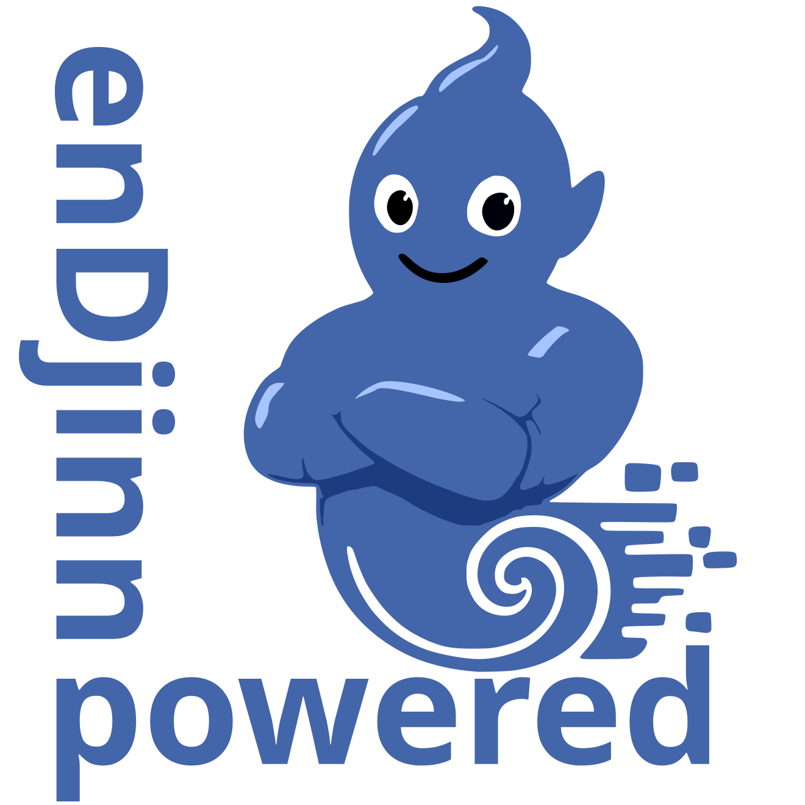

# enDjinn

enDjinn (a play on “engine” and the invisible helper of myth) is a small,
Dreamcast-first C runtime and build system. It handles recurring KOS/PVR
boilerplate while keeping the Dreamcast rendering model visible: applications
work with modes, PVR render lists, controllers, textures, fonts, sound, and
VMU/rumble devices rather than a generic cross-platform scene API.

<div>

</div>

## What it provides

- A frame loop that owns PVR scene setup and teardown.
- A stack of `enj_mode_t` game modes, including activation callbacks and soft
  reset support.
- Render-list callbacks for opaque, punch-through, and translucent PVR lists.
- Controller state transitions, abstract controllers, rumble, and VMU hooks.
- Build-time conversion of supported texture, TrueType font, and sound assets.
- A built-in quick font (`qfont`) for fast text rendering, plus generated
  proportional `.enjfont` files.
- `dctrace` and `dcprof` profiling helpers.

The [examples](./examples/README.md) are the best source of working,
feature-specific code.

## Quick start: Dreamcast

enDjinn expects an active KallistiOS environment. The repository’s
[`environ.sh`](./environ.sh) is a local convenience script for its configured
toolchain location; use your own KOS `environ.sh` if it lives elsewhere.

Create a project with `code/`, optionally `assets/`, a `local.cfg.mk`, and a
`Makefile` symlink to `base_link.mk`:

```sh
mkdir -p my-game/code
cd my-game
ln -s /path/to/enDjinn/base_link.mk Makefile
printf 'ENJ_INJECT_QFONT:=1\n' > local.cfg.mk
```

Then build from the project directory with `make`. The default Dreamcast
target is `bin/<project-name>.elf`. `make bin/<project-name>.cdi` creates a
CDI image, and `make bin/<project-name>.bin` creates a raw binary.

The minimal application is the [hello example](./examples/enj_hello/code/enj_hello.c):

```c
#include <enDjinn/enj_enDjinn.h>

void render(void *__unused) {
  enj_qfont_write("Hello, enDjinn!", 20, 20, PVR_LIST_PT_POLY);
}

void update(void *__unused) {
  enj_render_list_add(PVR_LIST_PT_POLY, render, NULL);
}

int main(__unused int argc, __unused char **argv) {
  enj_state_init_defaults();
  if (enj_state_startup() != 0) return -1;

  enj_mode_t mode = {.name = "Main", .mode_updater = update};
  enj_mode_push(&mode);
  enj_state_run();
  return 0;
}
```

## Runtime model

Call `enj_state_init_defaults()`, then `enj_state_startup()`, push at least
one mode, and call `enj_state_run()`. A mode’s `mode_updater` is called every
frame. It should update its state and register renderer callbacks with
`enj_render_list_add()`; enDjinn invokes each callback in the matching PVR
phase.

The mode stack is LIFO: push a pause/menu mode over the game, then call
`enj_mode_flag_end_current()` to end it on the next loop iteration and resume
the previous mode. `on_activation_fn` is called when a revealed mode becomes
active. Use `enj_mode_soft_reset_target_set()` to choose where the default
Start+A+B+X+Y soft-reset combination returns.

## Assets and build configuration

By default, source code is read from `code/`, textures from `assets/texture`,
fonts from `assets/fonts`, and sound effects from `assets/sfx`. Generated
Dreamcast assets are placed under `cdrom/<project-name>/` unless overridden.

Texture conversion is selected by the directory below `assets/texture`:
`pal4`, `pal8`, `rgb565_vq_tw`, and `argb1555_vq_tw` are supported. TrueType
files in `assets/fonts/<pixel-height>/` become `.enjfont` files. Sound files
in the supported ADPCM or PCM directory layouts become `.dca` files. The
sound converter must be installed as `dcaconv` on `PATH`, or supplied as
`SOUNDMACHINE=/path/to/dcaconv`. Builds never clone dependencies.

Put project-specific overrides in `local.cfg.mk`. The most useful current
variables are:

| Variable | Purpose |
| --- | --- |
| `ENJ_TARGET` | `dreamcast` (default), `pc-endjinn`, or `web-endjinn`. |
| `ENJ_BASENAME` | Output/project name; defaults to the current directory name. |
| `ENJ_CODEDIR` | C source directory; defaults to `./code`. |
| `ENJ_ROMDIR` | CD-ROM asset root; defaults to `cdrom`. |
| `ENJ_BUILDDIR`, `ENJ_BINDIR` | Object and output directories; default to `build` and `bin`. |
| `ENJ_LDLIBS` | Extra libraries passed to the Dreamcast link step. |
| `SOUNDMACHINE` | Path to the required `dcaconv` executable. |
| `ENJ_CFLAGS` | Additional C compiler flags. |
| `OPTLEVEL` | Optimisation level passed as `-O`; default is `g`. |
| `ENJ_DEBUG` | Enables `ENJ_DEBUG_PRINT` and Dreamcast debug instrumentation. |
| `ENJ_FSAA` | Enables FSAA and changes `ENJ_XSCALE` accordingly. |
| `ENJ_FRAME_RATE` | Enables a frame-rate deadline when set to a positive value. |
| `ENJ_WEB_SIMD` | Set to `1` to compile and link `web-endjinn` with WebAssembly SIMD128; defaults to `0`. |
| `ENJ_USE_SH4ZAM` | Set to `1` to build and link the optional SH4ZAM integration for the selected target. |
| `SH4ZAM_DIR` | Optional path to the SH4ZAM source tree when automatic discovery is unsuitable. |
| `ENJ_INJECT_QFONT` | Builds and embeds the built-in quick font. |
| `ENJ_ADD_LOGO_TEXTURE` | Adds enDjinn logo textures to the generated assets. |

When `ENJ_USE_SH4ZAM=1`, enDjinn builds SH4ZAM natively with CMake for
`pc-endjinn`, compiles its software implementation with Emscripten for
`web-endjinn`, and compiles its SH-4 implementation with KOS for `dreamcast`.
The integration is disabled by default; applications that use `shz_*` APIs
should enable it in `local.cfg.mk`. Set `SH4ZAM_DIR` explicitly or place the
source tree next to the application or enDjinn, or under `third_party/` or
`vendor/` in the application.

Set `ENJ_WEB_SIMD=1` to pass `-msimd128` to every WebAssembly compilation and
the final link, including optional integrations such as SH4ZAM. Leave it at
the default `0` when producing a scalar compatibility build.

Run `make cfg_info` in a project directory to inspect the resolved build
configuration, and `make auto_variables` to inspect generated asset and
object lists. `make assets` generates the same declared asset blobs for either
selected backend without linking an executable.

## PC backend

Set `ENJ_TARGET=pc-endjinn` to compile the supported runtime subset against
SDL2 and Vulkan/MoltenVK. It recompiles the same application against
KOS-shaped compatibility headers and links PC implementations of the required
KOS symbols; it is not a binary-only replacement for an already compiled
Dreamcast executable. This is a development backend, not a full Dreamcast
emulator.

From an enDjinn application directory:

```sh
make ENJ_TARGET=pc-endjinn
./build/pc-endjinn/my-game
```

The executable name defaults to the application directory name.

The backend supports the geometry, texture and palette formats used by the
examples, PCM sound effects, keyboard and SDL controllers, host save-file
storage, and screen-space modifier masks. Rumble, VMU LCD output, and some PVR
state remain unsupported. See the
[PC backend README](./backends/pc-endjinn/README.md) for setup and usage and
the [support matrix](./backends/pc-endjinn/SUPPORTED.md) for exact coverage.

## Browser backend

Set `ENJ_TARGET=web-endjinn` to compile the same application and generated
assets to WebAssembly with Emscripten, SDL2, and WebGL 2:

```sh
make ENJ_TARGET=web-endjinn
emrun build/web-endjinn/my-game.html
```

The browser target reuses the PC backend's input, audio, filesystem, and PVR
packet decoding shims. Its KOS-compatible sleep shim yields the unchanged
engine loop to the browser through Emscripten Asyncify. See the
[browser backend README](./backends/web-endjinn/README.md) for details.

## Profiling

The repository includes `profilers/dctrace.py`, `profilers/dcprof/`, and
helper scripts under `profilers/`. Set `ENJ_DCTRACE` or `ENJ_DCPROF` in
`local.cfg.mk` to include the corresponding Dreamcast-side instrumentation.
