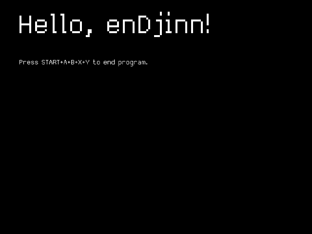
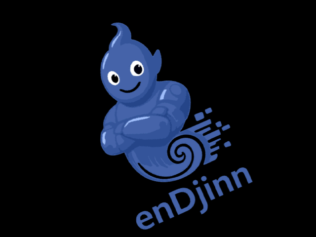
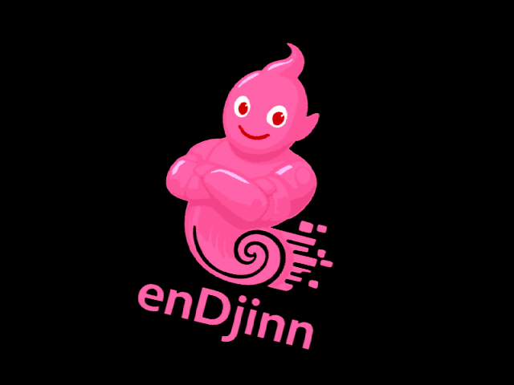
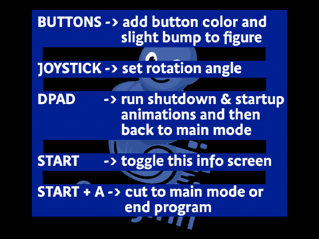
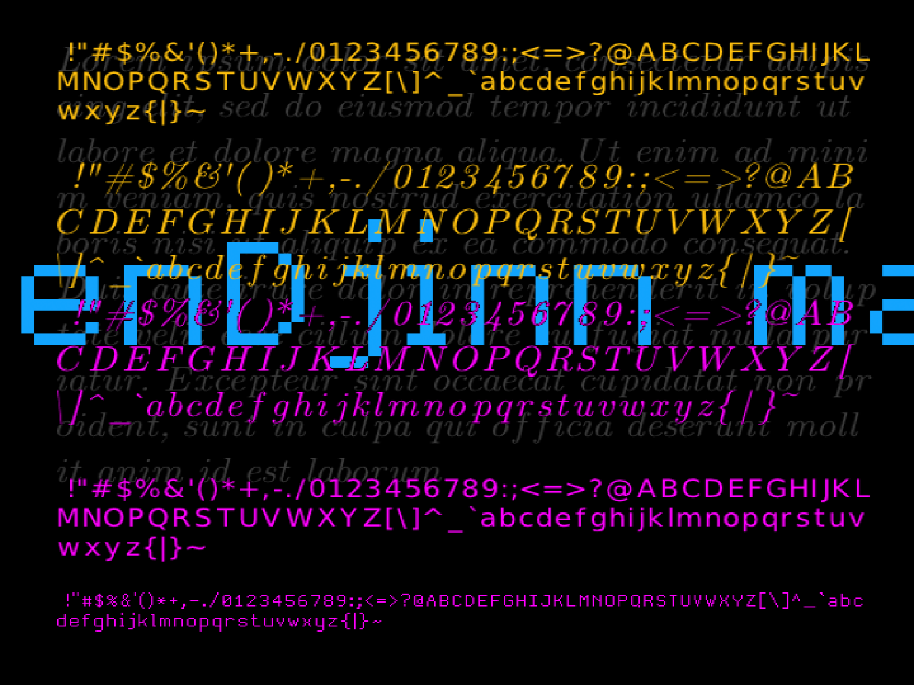
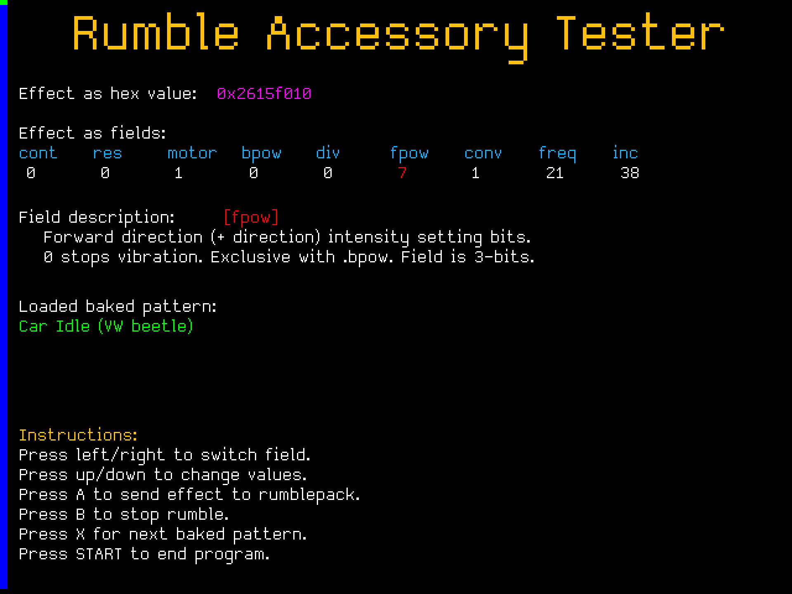
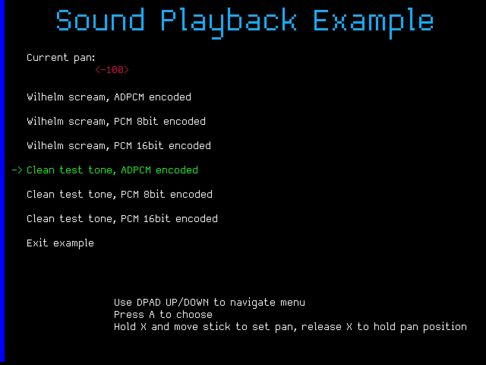

# enDjinn examples

The following examples are provided:

## enj_hello
enDjinn variant of writing 'hello world' on the Dreamcast screen, in less than 30 lines of code and one line of build configuration. This is also the simplest demonstration of the qfont system. 

It implicitly also shows of the power of the underlying enDjinn make system, that is activated simply by sym-linking the [enDjinn/Makefile.prime](../Makefile.prime) file to a **Makefile** in your project directory.

## enj_sprite
The [enj_hello](./enj_hello/) example is a bare bones 
 'get a rotating sprite on screen in fewer than 100 lines' of C. 

## enj_controls
The [enj_controls](./enj_controls/) example demonstrates the controller input reading system while adding a bit of interactivity.

## enj_modes
Most games will have several different modes that they switch between, like a titlescreen mode, a game setup 
mode a single player mode and so on and so on. 

The [enj_modes](./enj_modes/) example demonstrates the built in mode handling system in enDjinn, where modes and transitions
between them are organised in a FIFO stack. 

## enj_fonts 
The [enj_fonts](./enj_fonts/) example demonstrates the rich truetype based font system built into enDjinn.

## enj_rumbles
The rumble subsystem in enDjinn is basically a rate limiter that prevents the rumble packs from being overwhelmed with commands within the same frame.

The [enj_rumbles](./enj_rumbles/) example can help you create new rumble patterns for you games. 

## enj_sounds
The [enj_sounds](./enj_sounds/) example demonstrates how enDjinn integrates and uses the .dca audioformat by TapamN for sound effect loading and playback. 

