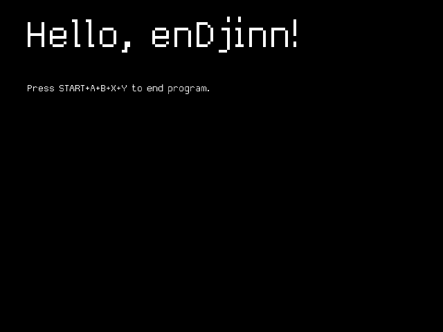
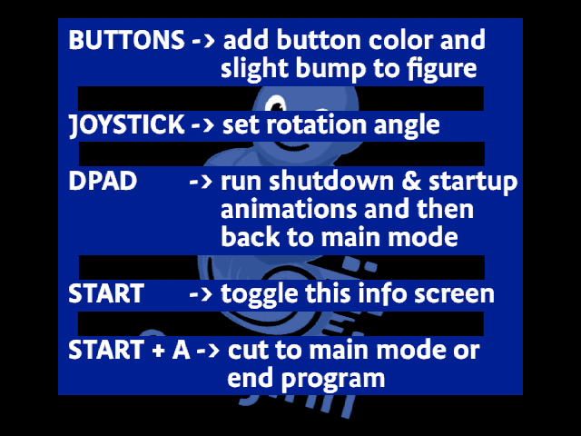
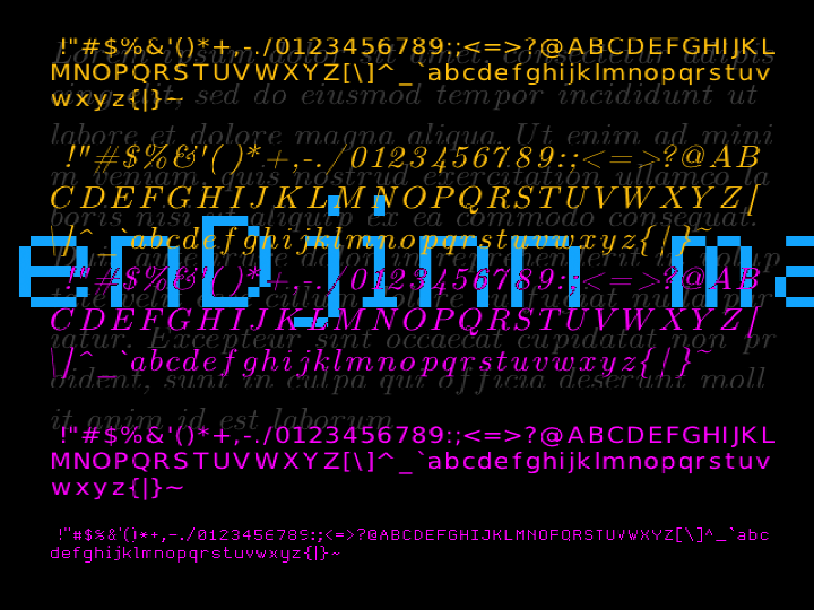
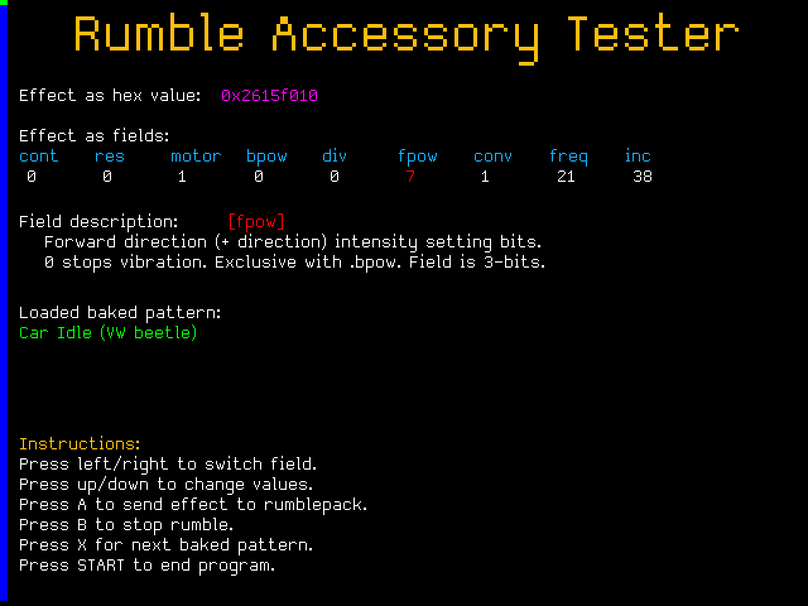
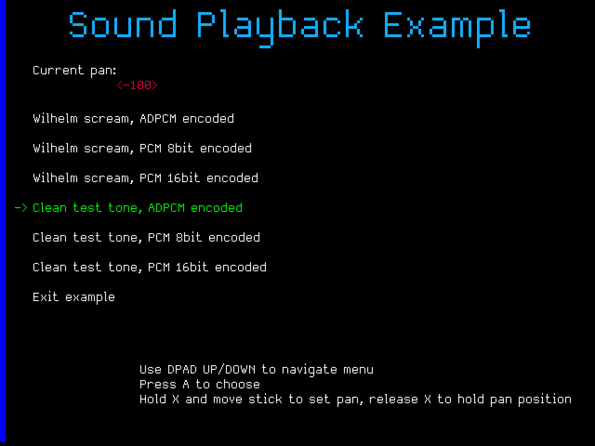

# enDjinn examples

Each example directory contains a `Makefile` symlink to
[`base_link.mk`](../base_link.mk), its C sources in `code/`, and any
project-specific build options in `local.cfg.mk`. With a KallistiOS
environment active, build one with:

```sh
make -C examples/enj_hello
```

The top-level `examples/Makefile` builds every example. All examples also
compile against pc-enDjinn:

```sh
make -C examples ENJ_TARGET=pc-endjinn
```

Most examples also build for the browser with
`ENJ_TARGET=web-endjinn`; browser prerequisites and invocation are covered in
the [web backend README](../backends/web-endjinn/README.md).

Textures, fonts, PCM sound effects, controllers, and depth-aware opaque and
transparent modifier volumes work on PC. Rumble and VMU LCD output remain
no-ops; see the
[pc-enDjinn support matrix](../backends/pc-endjinn/SUPPORTED.md) for the exact
differences. web-enDjinn implements the same depth-aware opaque and transparent
modifier classification through WebGL 2 stencil state and fragment evaluation.

## enj_hello

A minimal Dreamcast program in under 30 lines of C. It injects and renders the
built-in qfont.

<div>

</div>

## enj_sprite

Loads a generated texture and draws a rotating sprite in fewer than 100 lines
of C.

<div>

</div>

## enj_controls

Demonstrates controller-state reading and interaction.

<div>

</div>

## enj_modes

Demonstrates the LIFO mode stack, activation callbacks, and transitions
between a main mode, an information mode, and short animation modes.

<div>

</div>

## enj_flat_modifiers

Introduces modifier rendering with a planar, screen-oriented rectangle and a
colored receiver. `flat` is an enDjinn teaching term, not a separate KOS API;
KOS exposes modifier-volume primitives and list/material modes.

## enj_deep_modifiers

Adapts the closed 12-triangle cube from KallistiOS's
`modifier_volume_zclip` example into enDjinn's render-list loop. The rotating
volume crosses the near plane, is clipped and capped at `z=1`, and darkens only
the portions of a perspective ground grid and a solid 12-triangle box lying
inside the resulting depth volume. This KOS-style 3D scene provides receiver
depths across a single projected silhouette and a demanding regression for
pc-enDjinn's and web-enDjinn's modifier emulation while running from the same
source on Dreamcast hardware. Press A to cycle between opaque depth/stencil
receivers, transparent receivers evaluated independently at each fragment
depth, and mixed inside-transparent/outside-opaque receivers.

## enj_fonts

Demonstrates generated TrueType-based `.enjfont` assets and the font rendering
API.

<div>

</div>

## enj_rumbles

Demonstrates the rumble subsystem, including its command rate limiting.

<div>

</div>

## enj_sounds

Demonstrates conversion, loading, and playback of `.dca` sound-effect assets.

<div>

</div>
